# **BOTTEGA UNIVERSITY**

# **DOCUMENTACIÓN DE PYTHON PARA PRINCIPIANTES**

# **Introducción**

Esta documentación está pensada para personas que están empezando en Python. La idea es explicar los conceptos de forma clara, sencilla y con ejemplos prácticos para que se puedan entender fácilmente.

Python es un lenguaje de programación que es fácil de aprender. Se utiliza mucho para hacer sitios web, analizar datos, automatizar tareas, crear inteligencia artificial y muchas otras cosas. La forma en que se escribe el código es clara y fácil de entender, lo que lo hace ideal para personas que están empezando a programar.

# **1\. ¿Qué es un condicional?**

Un condicional es básicamente una estructura que permite que el programa tome decisiones basadas en ciertas condiciones. Dependiendo de si la condición es verdadera (True) o falsa (False), se ejecuta un bloque de código u otro. 

## **Concepto**

En programación, los condicionales se usan para comprobar valores de variables, validar datos de entrada y controlar el flujo de ejecución del programa.

## **Sintaxis en Python**

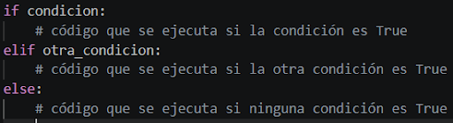

**Ejemplo:**

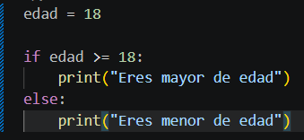

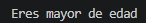

*En este caso, el programa comprueba la edad y muestra un mensaje dependiendo de si la condición edad \>= 18 es verdadera o falsa. Los condicionales también se pueden encadenar con elif para múltiples verificaciones.*

# **2\. Tipos de bucles en Python**

Los bucles son estructuras que permiten repetir un bloque de código varias veces, lo que hace que los programas sean más eficientes y fáciles de mantener. Son útiles cuando se quiere realizar la misma acción con diferentes datos, recorrer listas o repetir tareas automáticamente hasta que se cumpla una condición. Python tiene principalmente dos tipos de bucles: for y while.

## **Bucle for**

Se usa cuando se conoce de antemano cuántas veces se quiere repetir algo o se necesita recorrer una colección de datos.

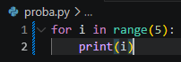

**Explicación:**  
*range(5) genera los números del 0 al 4 y el bucle imprime cada uno.*

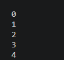

## **Bucle while**

Se usa cuando no se sabe exactamente cuántas veces se repetirá la acción, solo se pone una condición de continuación.

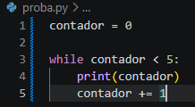

**Explicación:**  
*El bucle se ejecuta mientras la condición contador \< 5 sea verdadera.*

Los bucles son útiles porque evitan repetir código, hacen el programa más limpio y permiten trabajar con listas o datos fácilmente.

# **3\. ¿Qué es una lista por comprensión?**

Las listas por comprensión son una manera más rápida y clara de crear listas en Python. Permiten transformar, filtrar y generar listas nuevas a partir de otras existentes en una sola línea de código. Esto hace que el código sea un poco más limpio y legible en comparación con los bucles tradicionales.

Se usan mucho en procesamiento de datos, automatización y para generar resultados rápidamente sin necesidad de escribir múltiples líneas de código.

## **Sintaxis**

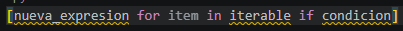

**Ejemplo**

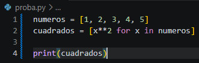

**Explicación:**  
*Cada elemento de la lista numeros se eleva al cuadrado y se guarda en la lista cuadrados.*

Las listas por comprensión pueden incluir condiciones (if) para filtrar elementos según criterios específicos, lo que las hace muy versátiles.

# **4\. ¿Qué es un argumento en Python?**

Un argumento es un valor que se pasa a una función para que esta pueda operar con él. Los argumentos permiten que las funciones sean flexibles y reutilizables, ya que el mismo bloque de código puede trabajar con diferentes datos.

Existen distintos tipos de argumentos los posicionales, por defecto y keyword. Los argumentos posicionales se pasan en el orden definido, los argumentos por defecto tienen un valor asignado si no se pasa ninguno y los keyword permiten especificar el nombre del argumento para mayor claridad.

**Ejemplo**

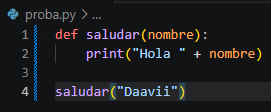

**Explicación:**  
*"Daavii" es el argumento que se pasa a la función saludar. Esto permite reutilizar la misma función con diferentes nombres sin cambiar su código interno.*

# **5\. ¿Qué es una función Lambda?**

Una función lambda es una función anónima de una sola línea que se utiliza para operaciones simples y rápidas. Son especialmente muy útiles cuando se necesita una función temporal que sólo se usará una vez, sin necesidad de definirla con def.

## **Sintaxis**

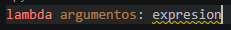

**Ejemplo**

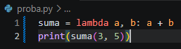

**Explicación:**  
*Crea una función que suma dos números sin necesidad de definirla con def.*

Se usan mucho en combinación con otras funciones como map(), filter() y reduce() para aplicar operaciones a listas o colecciones de manera eficiente. Aunque son muy prácticas, no se recomienda mucho usarlas para operaciones complejas, ya que puede hacer que no se entienda muy bien el código.

# **6\. ¿Qué es un paquete pip?**

pip básicamente es un gestor de paquetes de Python que permite instalar, actualizar y administrar librerías externas. Gracias a pip, se puede ampliar la funcionalidad de Python sin necesidad de escribir todo desde cero.

Usar pip es fundamental para proyectos más grandes, ya que permite integrar librerías como requests para manejar peticiones HTTP, numpy para matemáticas avanzadas, pandas para análisis de datos y muchas más. Es recomendable trabajar siempre dentro de entornos virtuales (venv) para no afectar la instalación global de Python.

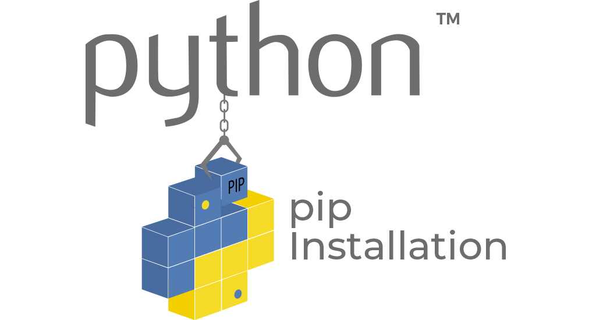

**Ejemplo**

pip install requests

**Explicación:**  
Esto instala la librería requests para trabajar con peticiones HTTP.