# CK7 Javascript \_ Documentación\_Davi

**BOTTEGA UNIVERSITY**

## **DOCUMENTACIÓN DE JAVASCRIPT PARA PRINCIPIANTES**

### **ÍNDICE**

[**INTRODUCCIÓN 3**](<CK7 Javascript _ Documentación_Davi.md#introducción>)

[**1. ¿QUÉ DIFERENCIA A JAVASCRIPT DE CUALQUIER OTRO LENGUAJE DE PROGRAMACIÓN? 4**](<CK7 Javascript _ Documentación_Davi.md#1.-¿qué-diferencia-a-javascript-de-cualquier-otro-lenguaje-de-programación?>)

[1.1 Características únicas de JavaScript 4](<CK7 Javascript _ Documentación_Davi.md#1.1-características-únicas-de-javascript>)

[1.2 Comparación con otros lenguajes 5](<CK7 Javascript _ Documentación_Davi.md#1.2-comparación-con-otros-lenguajes>)

[1.3 Ejemplo básico 5](<CK7 Javascript _ Documentación_Davi.md#1.3-ejemplo-básico>)

[**2. TIPOS DE DATOS EN JAVASCRIPT 6**](<CK7 Javascript _ Documentación_Davi.md#2.-tipos-de-datos-en-javascript>)

[2.1 Tipos Primitivos 6](<CK7 Javascript _ Documentación_Davi.md#2.1-tipos-primitivos>)

[2.2 Tipos de Referencia (Objetos) 8](<CK7 Javascript _ Documentación_Davi.md#2.2-tipos-de-referencia-(objetos)>)

[**3. TRES FUNCIONES ESENCIALES DE STRING EN JAVASCRIPT 10**](<CK7 Javascript _ Documentación_Davi.md#3.-tres-funciones-esenciales-de-string-en-javascript>)

[3.1 toUpperCase() y toLowerCase() — Cambiar mayúsculas/minúsculas 10](<CK7 Javascript _ Documentación_Davi.md#3.1-touppercase()-y-tolowercase()-—-cambiar-mayúsculas/minúsculas>)

[3.2 slice() — Extraer una parte del string 11](<CK7 Javascript _ Documentación_Davi.md#3.2-slice()-—-extraer-una-parte-del-string>)

[3.3 replace() — Reemplazar texto 12](<CK7 Javascript _ Documentación_Davi.md#3.3-replace()-—-reemplazar-texto>)

[**4. ¿QUÉ ES UN CONDICIONAL? 13**](<CK7 Javascript _ Documentación_Davi.md#4.-¿qué-es-un-condicional?>)

[4.1 Condicional if / else if / else 13](<CK7 Javascript _ Documentación_Davi.md#4.1-condicional-if-/-else-if-/-else>)

[4.2 El operador switch 13](<CK7 Javascript _ Documentación_Davi.md#4.2-el-operador-switch>)

[**5. ¿QUÉ ES EL OPERADOR TERNARIO? 15**](<CK7 Javascript _ Documentación_Davi.md#5.-¿qué-es-el-operador-ternario?>)

[5.1 Sintaxis 15](<CK7 Javascript _ Documentación_Davi.md#5.1-sintaxis>)

[5.2 Componentes del operador ternario 15](<CK7 Javascript _ Documentación_Davi.md#5.2-componentes-del-operador-ternario>)

[5.3 Ejemplos prácticos 16](<CK7 Javascript _ Documentación_Davi.md#5.3-ejemplos-prácticos>)

[**6. DECLARACIÓN DE FUNCIÓN VS EXPRESIÓN DE FUNCIÓN 17**](<CK7 Javascript _ Documentación_Davi.md#6.-declaración-de-función-vs-expresión-de-función>)

[6.1 Declaración de Función (Function Declaration) 17](<CK7 Javascript _ Documentación_Davi.md#6.1-declaración-de-función-(function-declaration)>)

[6.2 Expresión de Función (Function Expression) 18](<CK7 Javascript _ Documentación_Davi.md#6.2-expresión-de-función-(function-expression)>)

[6.3 Tabla comparativa 19](<CK7 Javascript _ Documentación_Davi.md#6.3-tabla-comparativa>)

[**7. LA PALABRA CLAVE "THIS" EN JAVASCRIPT 20**](<CK7 Javascript _ Documentación_Davi.md#7.-la-palabra-clave-"this"-en-javascript>)

[7.1 this en el ámbito global 20](<CK7 Javascript _ Documentación_Davi.md#7.1-this-en-el-ámbito-global>)

[7.2 this dentro de un objeto (método) 20](<CK7 Javascript _ Documentación_Davi.md#7.2-this-dentro-de-un-objeto-(método)>)

[7.3 this en una clase (ES6) 20](<CK7 Javascript _ Documentación_Davi.md#7.3-this-en-una-clase-(es6)>)

[7.4 this en Arrow Functions 21](<CK7 Javascript _ Documentación_Davi.md#7.4-this-en-arrow-functions>)

[7.5 Resumen del comportamiento de this 22](<CK7 Javascript _ Documentación_Davi.md#7.5-resumen-del-comportamiento-de-this>)

[**8. CONCLUSIONES 23**](<CK7 Javascript _ Documentación_Davi.md#8.-conclusiones>)

## **INTRODUCCIÓN** 

JavaScript es un lenguaje de programación interpretado y multiparadigma, esencial para el desarrollo web moderno. A diferencia de otros lenguajes que requieren compilación, JavaScript se ejecuta directamente en el navegador. Esto permite que las páginas web sean dinámicas e interactivas sin necesidad de recargarlas. Su versatilidad ha hecho que se use tanto en el frontend como en el backend, gracias a entornos como Node.js.

Este lenguaje permite manipular elementos de la página, validar formularios, manejar eventos y crear aplicaciones web completas. Su capacidad para trabajar de manera asíncrona lo hace ideal para tareas que requieren interacción con servidores o procesos en segundo plano sin interrumpir la experiencia del usuario.

En esta documentación, se abordarán los conceptos fundamentales de JavaScript. Se tratarán tipos de datos, funciones, condicionales, operadores y la palabra clave this. Cada tema se presentará con definiciones claras, ejemplos prácticos y explicaciones sobre su uso, para que cualquier principiante pueda comprender y aplicar los conceptos de manera efectiva.

## **1. ¿QUÉ DIFERENCIA A JAVASCRIPT DE CUALQUIER OTRO LENGUAJE DE PROGRAMACIÓN?** 

JavaScript es un lenguaje de programación creado en 1995 por Brendan Eich y es el único lenguaje de programación que los navegadores web entienden de forma nativa. Mientras que otros lenguajes como Python, Java o C++ necesitan un entorno especial instalado en tu ordenador para ejecutarse, JavaScript vive directamente en el navegador, lo que lo convierte básicamente en la base de toda la web interactiva que conocemos hoy.

### **1.1 Características únicas de JavaScript** 

* **Lenguaje del navegador:** Es el único lenguaje de scripting que todos los navegadores modernos (Chrome, Firefox, Safari, Edge) ejecutan de forma nativa, sin necesidad de plugins o instalaciones adicionales.
* **Ejecución del lado del cliente:** El código JS se ejecuta directamente en el ordenador del usuario (en el navegador), no en el servidor. Esto permite respuestas inmediatas sin tener que hacer una petición al servidor por cada acción.
* **Ejecución del lado del servidor:** Con la llegada de Node.js, JavaScript también puede ejecutarse en el servidor, siendo el único lenguaje capaz de funcionar tanto en el front-end como en el back-end.
* **Tipado dinámico:** No necesitas declarar el tipo de una variable (número, texto, etc.). JS lo detecta automáticamente en tiempo de ejecución.
* **Orientado a eventos:** JS está diseñado para reaccionar a eventos del usuario como clics, movimientos del ratón, pulsaciones de teclado, etc.
* **Lenguaje interpretado:** No necesita ser compilado (convertido a código máquina) antes de ejecutarse. Se interpreta línea a línea en tiempo real.

| ℹ ¿Por qué aprender JavaScript?                                                                                          |
| ------------------------------------------------------------------------------------------------------------------------ |
| JavaScript es el lenguaje más utilizado en el mundo según el índice TIOBE y encuestas de Stack Overflow año tras año.    |
| Es imprescindible para el desarrollo web tanto en el front-end (lo que el usuario ve) como en el back-end (el servidor). |
| Tiene el ecosistema de librerías y frameworks más grande: React, Vue, Angular, Express, Next.js, y cientos más.          |

### **1.2 Comparación con otros lenguajes** 

| Característica         | JavaScript   | Python       | Java      |
| ---------------------- | ------------ | ------------ | --------- |
| Ejecución en navegador | Nativo       | No           | No        |
| Ejecución en servidor  | (Node.js)    | Sí           | Sí        |
| Tipado                 | Dinámico     | Dinámico     | Estático  |
| Compilación            | Interpretado | Interpretado | Compilado |
| Orientado a eventos    | Nativo       | Parcial      | Parcial   |

### **1.3 Ejemplo básico** 

El siguiente código muestra cómo JavaScript puede modificar una página web en tiempo real, algo imposible con HTML o CSS solos:

| Resultado                                                                            |
| ------------------------------------------------------------------------------------ |
| Cuando el usuario hace clic en el botón, el texto del título cambia instantáneamente |
| sin recargar la página. Esto es posible gracias a la capacidad de JS para manipular  |
| el DOM o Document Object Model en tiempo real.                                       |

## **2. TIPOS DE DATOS EN JAVASCRIPT** 

En JavaScript, un tipo de dato define qué clase de información puede almacenar una variable. A diferencia de otros lenguajes como Java, en JS no necesitas especificar el tipo al declarar una variable, el lenguaje lo detecta automáticamente. Existen dos categorías principales, los de tipos primitivos y tipos de referencia u objetos.

### **2.1 Tipos Primitivos** 

Los tipos primitivos son los bloques de construcción más básicos. Son inmutables, lo que significa que su valor no puede modificarse directamente (se crea uno nuevo cada vez).

#### **Number — Números**

Representa tanto números enteros como decimales. JS no distingue entre ambos, todo es Number.

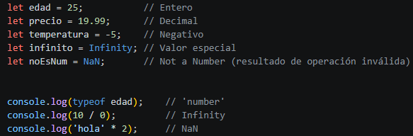

#### **String — Cadenas de texto**

Representa cualquier texto. Se puede escribir con comillas simples, dobles o backticks (template literals).

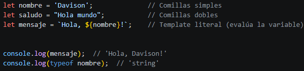

#### **Boolean — Verdadero o Falso**

Solo puede tener dos valores: true o false. Es fundamental para tomar decisiones en el código (condicionales, bucles).

#### **Undefined — Sin valor asignado**

Cuando declaras una variable pero no le asignas ningún valor, su tipo y valor es undefined. JavaScript lo asigna automáticamente.

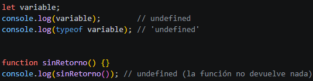

#### **Null — Ausencia intencional de valor**

A diferencia de undefined (asignado automáticamente), null lo asigna el programador de forma explícita para indicar que una variable está vacía o sin valor intencionalmente.

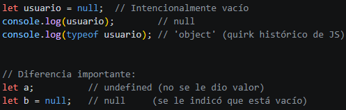

#### **Symbol — Identificador único**

Introducido en ES6. Crea valores únicos e irrepetibles, útiles como claves de propiedades en objetos para evitar colisiones de nombres.

### **2.2 Tipos de Referencia (Objetos)** 

#### **Object — Objetos**

Un objeto agrupa propiedades (pares clave-valor) relacionadas bajo un mismo nombre. Es la estructura de datos más versátil de JS.

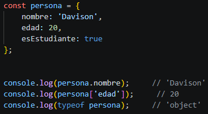

#### **Array — Arreglos**

Un array es una lista ordenada de valores. En JS, un array puede contener elementos de diferentes tipos.

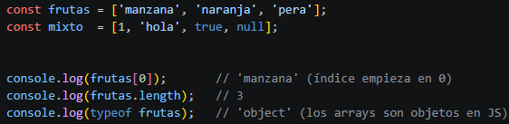

| ℹ Resumen de tipos de datos                                            |
| ---------------------------------------------------------------------- |
| Primitivos: Number, String, Boolean, Undefined, Null, Symbol, BigInt   |
| Referencia (objetos): Object, Array, Function, Date, RegExp...         |
| Usa typeof para saber el tipo de cualquier valor: typeof 42 → 'number' |

## **3. TRES FUNCIONES ESENCIALES DE STRING EN JAVASCRIPT** 

Los strings (cadenas de texto) en JavaScript son objetos con muchos métodos incorporados. Aquí exploramos tres de los más usados y útiles para manipular texto: toUpperCase() / toLowerCase(), slice() y replace().

### **3.1 toUpperCase() y toLowerCase() — Cambiar mayúsculas/minúsculas** 

#### **¿Qué hace?**

toUpperCase() convierte todos los caracteres de un string a mayúsculas. toLowerCase() hace lo contrario: convierte todo a minúsculas. Ninguno modifica el string original, ambos devuelven uno nuevo.

#### **¿Para qué se usa?**

* Normalizar texto para comparaciones sin distinguir mayúsculas ('Hola' === 'hola' sería false, pero con toLowerCase() son iguales).
* Formatear texto para presentación al usuario.
* Validar entradas de formularios independientemente de cómo el usuario escribió el texto.

#### **Sintaxis**

#### **Ejemplo práctico**

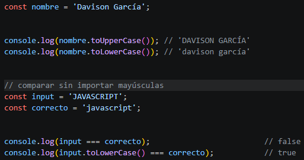

### **3.2 slice() — Extraer una parte del string** 

#### **¿Qué hace?**

slice() extrae una porción de un string y la devuelve como un nuevo string, sin modificar el original. Recibe dos parámetros: el índice de inicio y el de fin (sin incluir el índice de fin). Los índices pueden ser negativos (cuentan desde el final).

#### **¿Para qué se usa?**

* Recortar texto largo (por ejemplo, una descripción larga para mostrar solo los primeros 100 caracteres).
* Extraer partes específicas de un string (extensión de un archivo, dominio de un email, etc.).
* Obtener los últimos N caracteres de un string usando índices negativos.

#### **Sintaxis**

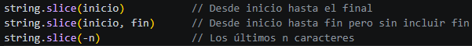

#### **Ejemplo práctico**

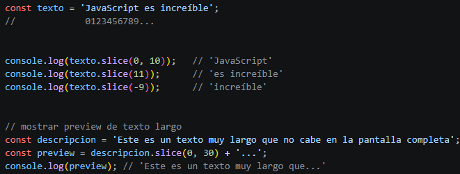

### **3.3 replace() — Reemplazar texto** 

#### **¿Qué hace?**

replace() busca una coincidencia en el string y la reemplaza por otro texto. Devuelve un nuevo string (no modifica el original). Por defecto solo reemplaza la primera coincidencia, a menos que se use una expresión regular con la bandera global /g.

#### **¿Para qué se usa?**

* Limpiar o formatear texto de entrada del usuario.
* Censurar palabras o caracteres.
* Transformar formatos (ejemplo: cambiar separadores en fechas).

#### **Sintaxis**

#### **Ejemplo práctico**

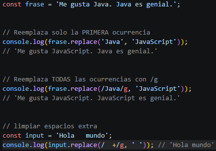

| ℹ Tabla resumen de métodos de String                                 |
| -------------------------------------------------------------------- |
| toUpperCase() / toLowerCase() → Cambia entre mayúsculas y minúsculas |
| slice(inicio, fin) → Extrae una porción del string                   |
| replace(buscar, nuevo) → Reemplaza texto dentro del string           |

## **4. ¿QUÉ ES UN CONDICIONAL?** 

Un condicional es una estructura de control que permite ejecutar diferentes bloques de código dependiendo de si una condición es verdadera (true) o falsa (false). Son la base de la toma de decisiones en programación: le dicen al programa qué hacer en cada situación posible.

### **4.1 Condicional if / else if / else** 

La estructura más común es if / else if / else. Se evalúa la condición entre paréntesis; si es verdadera se ejecuta el bloque del if, y si no, se pasan a evaluar las condiciones del else if, y finalmente el else actúa como caso por defecto.

#### **Sintaxis**

#### **Ejemplo práctico**

### **4.2 El operador switch** 

switch es útil cuando tienes una variable que puede tomar muchos valores distintos y quieres ejecutar código diferente para cada uno. Es más legible que encadenar muchos else if cuando comparas el mismo valor.

#### **Sintaxis**

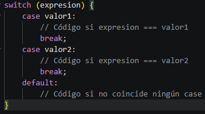

#### **Ejemplo práctico**

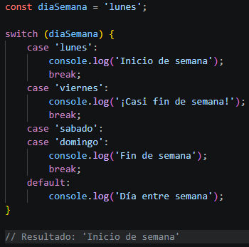

| ℹ Valores False y True en JS                                                      |
| --------------------------------------------------------------------------------- |
| En JS, cualquier valor puede evaluarse como true o false en un condicional.       |
| Valores FALSE (se evalúan como false): false, 0, '', null, undefined, NaN         |
| Todos los demás valores son TRUE (se evalúan como true): 1, 'hola', \[], {}, etc. |

## **5. ¿QUÉ ES EL OPERADOR TERNARIO?** 

El operador ternario es una forma abreviada de escribir un condicional if/else en una sola línea. Es especialmente útil cuando quieres asignar un valor a una variable en función de una condición, sin necesitar escribir un bloque completo de if/else. Su nombre viene de que opera sobre tres operandos.

### **5.1 Sintaxis** 

### **5.2 Componentes del operador ternario** 

| Parte              | Símbolo         | Descripción                                 |
| ------------------ | --------------- | ------------------------------------------- |
| Condición          | (antes del ?)   | Expresión que se evalúa como true o false   |
| Valor si verdadero | (entre ? y :)   | Lo que se devuelve si la condición es true  |
| Valor si falso     | (después del :) | Lo que se devuelve si la condición es false |

### **5.3 Ejemplos prácticos** 

#### **Ejemplo 1: Asignación de variable**

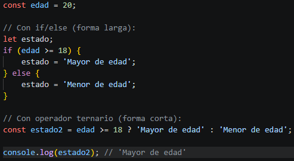

#### **Ejemplo 2: En template literals**

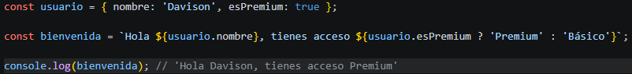

#### **Ejemplo 3: Ternario anidado**

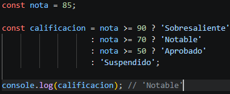

| ℹ Consejo: ¿Cuándo usar ternario vs if/else?                                                                  |
| ------------------------------------------------------------------------------------------------------------- |
| USA el ternario cuando: la lógica es simple y cabe en una línea legible.                                      |
| USA if/else cuando: la lógica es compleja, tienes múltiples instrucciones, o el código sería difícil de leer. |
| Prioriza siempre la legibilidad sobre la brevedad.                                                            |

## **6. DECLARACIÓN DE FUNCIÓN VS EXPRESIÓN DE FUNCIÓN** 

En JavaScript hay dos formas principales de definir funciones: la declaración de función (Function Declaration) y la expresión de función (Function Expression). Ambas hacen lo mismo en esencia (definir un bloque de código reutilizable), pero tienen diferencias importantes en cómo funcionan internamente.

### **6.1 Declaración de Función (Function Declaration)** 

Una declaración de función usa la palabra clave function seguida de un nombre. Es la forma más tradicional y explícita de crear una función.

#### **Sintaxis**

#### **Ejemplo**

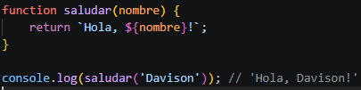

#### **Hoisting**

La característica más importante de las declaraciones de función es el hoisting (elevación). JavaScript mueve las declaraciones de función al inicio del ámbito antes de ejecutar el código, lo que significa que puedes llamar a la función ANTES de declararla en el código.

### **6.2 Expresión de Función (Function Expression)** 

Una expresión de función asigna una función a una variable. La función puede ser anónima sin nombre o tener un nombre interno. También incluye las arrow functions, funciones flecha de ES6.

#### **Sintaxis**

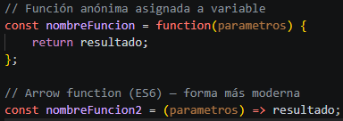

#### **Ejemplo**

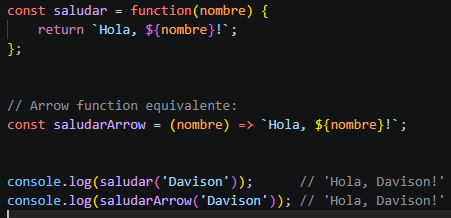

#### **Sin Hoisting**

Las expresiones de función NO tienen hoisting. Si intentas llamarlas antes de declararlas, obtendrás un error.

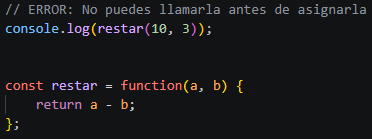

### **6.3 Tabla comparativa** 

| Característica | Declaración de Función             | Expresión de Función            |
| -------------- | ---------------------------------- | ------------------------------- |
| Sintaxis       | function nombre() {}               | const nombre = function() {}    |
| Hoisting       | Sí (se puede usar antes)           | No (solo después de asignarse)  |
| Nombre         | Obligatorio                        | Opcional (puede ser anónima)    |
| Arrow function | No aplica                          | Soporta sintaxis =>             |
| Uso típico     | Funciones principales del programa | Callbacks, funciones temporales |

| ¿Cuándo usar cada una?                                                                                                                                                     |
| -------------------------------------------------------------------------------------------------------------------------------------------------------------------------- |
| Declaración: cuando la función es central en tu módulo y quieres poder usarla en cualquier parte del archivo.                                                              |
| Expresión: cuando pasas la función como argumento a otra función (callback), cuando usas arrow functions, o cuando quieres control explícito sobre cuándo está disponible. |

## **7. LA PALABRA CLAVE "THIS" EN JAVASCRIPT** 

"this" es una de las características más confusas de JavaScript para los principiantes. En pocas palabras, this hace referencia al contexto de ejecución actual: el objeto desde el cual se está llamando la función en ese momento. Su valor NO es fijo, depende de cómo y dónde se llama la función.

### **7.1 this en el ámbito global** 

Cuando usas this fuera de cualquier función u objeto (en el ámbito global), en un navegador apunta al objeto window (el objeto global del navegador).

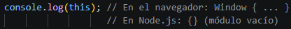

### **7.2 this dentro de un objeto (método)** 

Cuando una función es un método de un objeto, this apunta al objeto que contiene ese método. Este es el uso más común y natural de this.

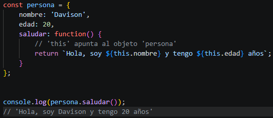

### **7.3 this en una clase (ES6)** 

En las clases de JavaScript, this se usa dentro del constructor y los métodos para referirse a la instancia específica del objeto que se está creando o usando.

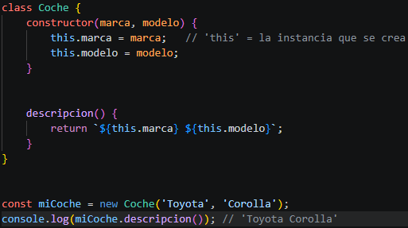

### **7.4 this en Arrow Functions** 

Las arrow functions NO tienen su propio this. En su lugar, heredan el this del contexto donde fueron definidas. Esto es muy importante y es la razón principal por la que se usan arrow functions en callbacks dentro de métodos.

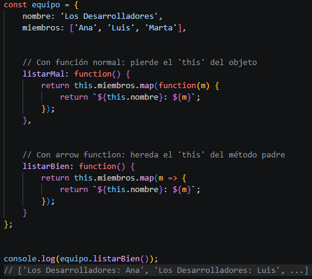

### **7.5 Resumen del comportamiento de this** 

| Contexto                   | ¿A qué apunta this?                           |
| -------------------------- | --------------------------------------------- |
| Ámbito global (navegador)  | Objeto window                                 |
| Método de un objeto        | El objeto que contiene el método              |
| Constructor / clase        | La nueva instancia creada con new             |
| Arrow function             | Hereda el this del contexto exterior (léxico) |
| Función normal en callback | undefined (en modo estricto) o window         |

| ℹ Consejo clave sobre this                                                                   |
| -------------------------------------------------------------------------------------------- |
| Regla simple: this es el objeto que está 'a la izquierda del punto' cuando llamas al método. |
| Ejemplo: persona.saludar() → this = persona                                                  |
| Cuando no hay objeto antes del punto, this puede ser undefined o el objeto global.           |

## **8. CONCLUSIONES** 

A lo largo de este documento hemos recorrido los conceptos fundamentales de JavaScript que todo desarrollador principiante necesita dominar. A continuación un resumen de lo aprendido.

| Concepto                      | Resumen clave                                                                                 |
| ----------------------------- | --------------------------------------------------------------------------------------------- |
| JavaScript vs otros lenguajes | Único lenguaje nativo del navegador; puede ejecutarse en front y back-end con Node.js         |
| Tipos de datos                | Primitivos (Number, String, Boolean, Null, Undefined, Symbol) y de referencia (Object, Array) |
| Métodos de String             | toUpperCase/toLowerCase (cambio de caso), slice (extraer), replace (reemplazar)               |
| Condicionales                 | if/else if/else y switch para ejecutar código según condiciones                               |
| Operador ternario             | Forma abreviada de if/else: condicion ? siTrue : siFalse                                      |
| Funciones                     | Declaración (con hoisting) vs Expresión (sin hoisting, incluye arrow functions)               |
| this                          | Referencia al contexto actual; varía según cómo y dónde se llama la función                   |
| Ejercicio práctico            | Función que suma pares de argumentos, los multiplica y compara con 50                         |
