**BOTTEGA UNIVERSITY**

# **DOCUMENTACIÓN EXTENDIDA DE JAVASCRIPT PARA PRINCIPIANTES**

## **ÍNDICE**

[**INTRODUCCIÓN	4**](#introducción)

[**1\. ¿QUÉ TIPO DE BUCLES HAY EN JS?	5**](#1.-¿qué-tipo-de-bucles-hay-en-js?)

[¿Qué es un bucle?	5](#¿qué-es-un-bucle?)

[1.1 Bucle for	5](#1.1-bucle-for)

[1.2 Bucle while	6](#1.2-bucle-while)

[1.3 Bucle do...while	7](#1.3-bucle-do...while)

[1.4 Bucle for...of	8](#1.4-bucle-for...of)

[1.5 Bucle for...in	9](#1.5-bucle-for...in)

[1.6 Sentencias break y continue	10](#1.6-sentencias-break-y-continue)

[Resumen: ¿cuándo usar cada bucle?	11](#resumen:-¿cuándo-usar-cada-bucle?)

[**2\. ¿CUÁLES SON LAS DIFERENCIAS ENTRE CONST, LET Y VAR?	12**](#2.-¿cuáles-son-las-diferencias-entre-const,-let-y-var?)

[¿Qué es una variable?	12](#¿qué-es-una-variable?)

[2.1 var — la forma antigua	12](#2.1-var-—-la-forma-antigua)

[2.2 let — la forma moderna para valores que cambian	13](#2.2-let-—-la-forma-moderna-para-valores-que-cambian)

[2.3 const — para valores que no cambian	14](#2.3-const-—-para-valores-que-no-cambian)

[2.4 Tabla comparativa	15](#2.4-tabla-comparativa)

[**3\. ¿QUÉ ES UNA FUNCIÓN DE FLECHA?	16**](#3.-¿qué-es-una-función-de-flecha?)

[¿Qué es una función?	16](#¿qué-es-una-función?)

[¿Qué es una función de flecha?	16](#¿qué-es-una-función-de-flecha?)

[3.1 Evolución de la sintaxis	16](#3.1-evolución-de-la-sintaxis)

[3.2 Sintaxis	17](#3.2-sintaxis)

[3.3 Uso con métodos de arrays	18](#3.3-uso-con-métodos-de-arrays)

[3.4 this en funciones flecha — diferencia clave	18](#3.4-this-en-funciones-flecha-—-diferencia-clave)

[3.5 Cuándo SÍ y cuándo NO usar funciones flecha	18](#3.5-cuándo-sí-y-cuándo-no-usar-funciones-flecha)

[**4\. ¿QUÉ ES LA DESESTRUCTURACIÓN DE VARIABLES?	20**](#4.-¿qué-es-la-desestructuración-de-variables?)

[¿Qué es?	20](#¿qué-es?)

[4.1 Desestructuración de Objetos	20](#4.1-desestructuración-de-objetos)

[4.2 Desestructuración de Arrays	21](#4.2-desestructuración-de-arrays)

[4.3 Desestructuración en parámetros de funciones	21](#4.3-desestructuración-en-parámetros-de-funciones)

[4.4 Desestructuración en bucles for...of	22](#4.4-desestructuración-en-bucles-for...of)

[**5\. ¿QUÉ HACE EL OPERADOR DE EXTENSIÓN (SPREAD & REST)?	23**](#5.-¿qué-hace-el-operador-de-extensión-\(spread-&-rest\)?)

[¿Qué es?	23](#¿qué-es?-1)

[5.1 Spread en Arrays	23](#5.1-spread-en-arrays)

[5.2 Spread en Objetos	25](#5.2-spread-en-objetos)

[5.3 Rest Operator — agrupar elementos	26](#5.3-rest-operator-—-agrupar-elementos)

[5.4 Resumen: Spread vs Rest	27](#5.4-resumen:-spread-vs-rest)

[**6\. ¿QUÉ ES LA PROGRAMACIÓN ORIENTADA A OBJETOS (POO)?	28**](#6.-¿qué-es-la-programación-orientada-a-objetos-\(poo\)?)

[¿Qué es la POO?	28](#¿qué-es-la-poo?)

[6.1 Los cuatro pilares de la POO	28](#6.1-los-cuatro-pilares-de-la-poo)

[6.2 Clases y Objetos en JavaScript	29](#6.2-clases-y-objetos-en-javascript)

[6.3 Herencia con extends y super	30](#6.3-herencia-con-extends-y-super)

[6.4 Getters y Setters	32](#6.4-getters-y-setters)

[6.5 Métodos y propiedades estáticas	33](#6.5-métodos-y-propiedades-estáticas)

[**7\. ¿QUÉ ES UNA PROMESA EN JS?	34**](#7.-¿qué-es-una-promesa-en-js?)

[El problema del código asíncrono	34](#el-problema-del-código-asíncrono)

[7.1 ¿Qué es una promesa?	34](#7.1-¿qué-es-una-promesa?)

[7.2 Crear una promesa	34](#7.2-crear-una-promesa)

[7.3 Consumir una promesa con .then(), .catch(), .finally()	35](#7.3-consumir-una-promesa-con-.then\(\),-.catch\(\),-.finally\(\))

[7.4 Métodos estáticos de Promise	35](#7.4-métodos-estáticos-de-promise)

[**8\. ¿QUÉ HACEN ASYNC Y AWAIT?	37**](#8.-¿qué-hacen-async-y-await?)

[El problema con las cadenas de .then()	37](#el-problema-con-las-cadenas-de-.then\(\))

[8.1 ¿Qué es async/await?	37](#8.1-¿qué-es-async/await?)

[8.2 Comparación directa: Promesas vs async/await	38](#8.2-comparación-directa:-promesas-vs-async/await)

# 

# **INTRODUCCIÓN** {#introducción}

JavaScript es un lenguaje de programación interpretado y multiparadigma, esencial para el desarrollo web moderno. A diferencia de otros lenguajes que requieren compilación, JavaScript se ejecuta directamente en el navegador. Esto permite que las páginas web sean dinámicas e interactivas sin necesidad de recargarlas. Su versatilidad ha hecho que se use tanto en el frontend como en el backend, gracias a entornos como Node.js.

Este lenguaje permite manipular elementos de la página, validar formularios, manejar eventos y crear aplicaciones web completas. Su capacidad para trabajar de manera asíncrona lo hace ideal para tareas que requieren interacción con servidores o procesos en segundo plano sin interrumpir la experiencia del usuario.

En esta documentación, se abordarán los conceptos fundamentales de JavaScript. Se tratarán tipos de datos, funciones, condicionales, operadores y la palabra clave this. Cada tema se presentará con definiciones claras, ejemplos prácticos y explicaciones sobre su uso, para que cualquier principiante pueda comprender y aplicar los conceptos de manera efectiva.

# **1\. ¿QUÉ TIPO DE BUCLES HAY EN JS?** {#1.-¿qué-tipo-de-bucles-hay-en-js?}

## **¿Qué es un bucle?** {#¿qué-es-un-bucle?}

Un bucle es una estructura de control que permite repetir un bloque de código múltiples veces mientras se cumpla una condición determinada.  
Sin bucles, si quisiéramos imprimir los números del 1 al 100 tendríamos que escribir console.log() cien veces. Con un bucle, lo hacemos en 3 líneas.

Los bucles son fundamentales en programación porque evitan la repetición de código, permiten recorrer listas, arrays y objetos, automatizan tareas repetitivas y hacen el código más limpio y mantenible

JavaScript ofrece varios tipos de bucles, cada uno pensado para situaciones distintas.

## **1.1 Bucle for** {#1.1-bucle-for}

### **¿Qué es?**

El bucle for es el más clásico y utilizado. Se usa cuando conoces cuántas veces debe repetirse el código.

### **¿Para qué sirve?**

* Recorrer arrays por índice  
* Repetir una acción un número exacto de veces  
* Iterar sobre caracteres de un string  
* Realizar operaciones matemáticas iterativas

### **Sintaxis**

*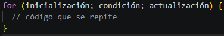

* **Inicialización:** se ejecuta una sola vez al inicio. Generalmente declara el contador.  
* **Condición:** se evalúa antes de cada vuelta. Si es true, el bucle continúa. Si es false, se detiene.  
* **Actualización:** se ejecuta al final de cada vuelta. Generalmente incrementa o decrementa el contador.

### **Ejemplos**

*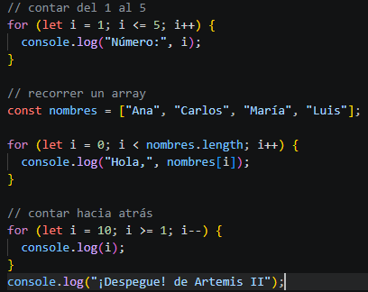

## **1.2 Bucle while** {#1.2-bucle-while}

### **¿Qué es?**

El bucle while repite el código mientras una condición sea verdadera. A diferencia del for, no tienes que saber cuántas veces se repetirá.

### **¿Para qué sirve?**

* Validar entradas del usuario hasta que sean correctas  
* Esperar a que ocurra un evento  
* Procesar datos cuya cantidad desconoces  
* Leer archivos o streams de datos

### **Sintaxis**

*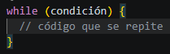

| ⚠️ IMPORTANTE: Si la condición nunca se vuelve false, el bucle se ejecutará para siempre (bucle infinito), lo que congela el programa. Siempre hay que asegurarse de que algo dentro del bucle eventualmente haga falsa la condición. |
| :---- |

### **Ejemplos**

*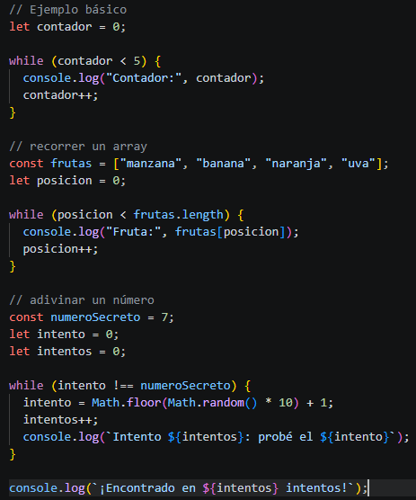

## **1.3 Bucle do...while** {#1.3-bucle-do...while}

### **¿Qué es?**

Similar al while, pero con una diferencia de que se ejecuta el código al menos una vez antes de evaluar la condición. Primero actúa, luego pregunta.

### **¿Para qué sirve?**

* Mostrar un menú que debe aparecer al menos una vez  
* Solicitar datos al usuario y repetir si son inválidos  
* Procesar algo que debe ocurrir mínimo una vez

### **Sintaxis**

*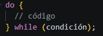

### **Ejemplos**

*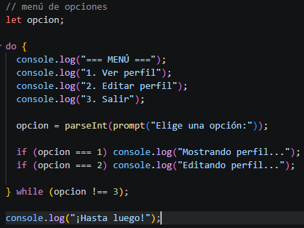

## **1.4 Bucle for...of** {#1.4-bucle-for...of}

### **¿Qué es?**

Introducido en ES6, el for...of recorre los valores de cualquier objeto iterable, como arrays, strings, Maps, Sets, etc. Es más limpio y legible que el for clásico cuando solo necesitas los valores.

### **¿Para qué sirve?**

* Recorrer arrays de forma elegante  
* Iterar sobre caracteres de un string  
* Recorrer colecciones de datos (Maps, Sets)  
* Cuando no necesitas el índice, solo el valor

### **Sintaxis**

*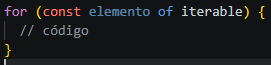

### **Ejemplos**

*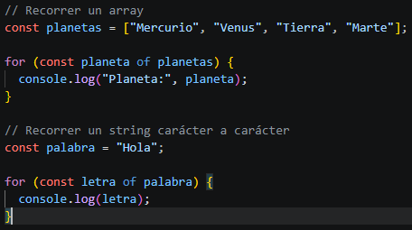

## **1.5 Bucle for...in** {#1.5-bucle-for...in}

### **¿Qué es?**

El for...in recorre las claves (propiedades) de un objeto. No está diseñado para arrays (aunque técnicamente funciona), sino para objetos.

### **¿Para qué sirve?**

* Inspeccionar las propiedades de un objeto  
* Copiar o transformar objetos  
* Depurar y ver qué contiene un objeto

### **Sintaxis**

*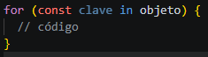

### **Ejemplos**

*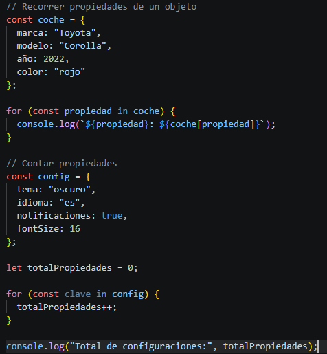

## **1.6 Sentencias break y continue** {#1.6-sentencias-break-y-continue}

Estas palabras clave permiten controlar el flujo de cualquier bucle.  
*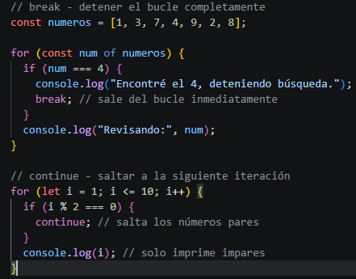

## **Resumen: ¿cuándo usar cada bucle?** {#resumen:-¿cuándo-usar-cada-bucle?}

| Bucle | Cuando usar | Ventaja principal |
| :---- | :---- | :---- |
| for | Conoces el número exacto de repeticiones | Control total sobre el contador |
| while | No sabes cuántas repeticiones habrá | Flexible, depende de una condición |
| do...while | Necesitas ejecutarlo al menos una vez | Garantiza una ejecución inicial |
| for...of | Recorres valores de un array/iterable | Simple y legible, sin índices |
| for...in | Recorres propiedades de un objeto | Acceso directo a claves |

# **2\. ¿CUÁLES SON LAS DIFERENCIAS ENTRE CONST, LET Y VAR?** {#2.-¿cuáles-son-las-diferencias-entre-const,-let-y-var?}

## **¿Qué es una variable?** {#¿qué-es-una-variable?}

Una variable es un espacio donde guardamos un dato para usarlo más tarde. En JavaScript hay tres formas de declarar variables, con var, let o const. Cada una tiene comportamientos distintos.

## **2.1 var — la forma antigua** {#2.1-var-—-la-forma-antigua}

var existe desde los inicios de JavaScript (ES5). Hoy en día se evita en código moderno porque tiene comportamientos confusos que llevan a errores inesperados.

### **Características de var**

Es reasignable y redeclarable.

*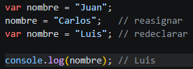

Se puede redeclarar una variable sin errores es problemático porque puedes sobreescribir accidentalmente una variable que ya existía sin darte cuenta. El mayor problema de var es su alcance. Una variable var declarada dentro de un if, for, etc., escapa al bloque y queda disponible en toda la función.

*

Esto es confuso porque visualmente parece que el mensaje debería existir solo dentro del if.

Problema con var en bucles. Problema clásico con var en setTimeout

*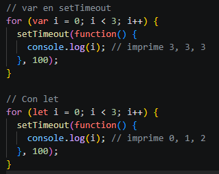

## **2.2 let — la forma moderna para valores que cambian** {#2.2-let-—-la-forma-moderna-para-valores-que-cambian}

let fue introducido en ES6 (2015) para solucionar los problemas de var. Es la elección correcta cuando necesitas una variable cuyo valor va a cambiar.

### **Características de let**

Es reasignable, pero NO redeclarable.

*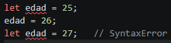

Scope de bloque. Una variable let solo existe dentro del bloque { } donde fue declarada.

*

Funciona correctamente en bucles.

*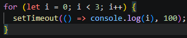

## **2.3 const — para valores que no cambian** {#2.3-const-—-para-valores-que-no-cambian}

const también llegó en ES6. Se usa para declarar variables cuyo valor no debe cambiar después de asignarse. Es la elección predeterminada recomendada en código moderno.

### **Características de const**

NO es reasignable ni redeclarable.

*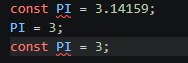

Debe inicializarse al declararse.

*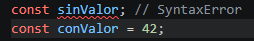

### **Caso especial: const con objetos y arrays**

const no permite reasignar la variable (cambiar a qué apunta), pero sí permite modificar el contenido del objeto o array al que apunta. 

*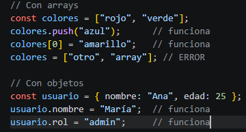

La razón es que const protege la referencia en memoria, no el contenido. El objeto en memoria puede cambiar, pero la variable siempre apuntará al mismo objeto.

## **2.4 Tabla comparativa** {#2.4-tabla-comparativa}

| Característica | var | let | const |
| :---- | :---- | :---- | :---- |
| Reasignable | Sí | Sí | No |
| Redeclarable | Sí | No | No |
| Requiere inicialización | No | No | Sí |
| ¿Recomendado hoy? | Evitar | Para valores cambiantes | Por defecto |

# **3\. ¿QUÉ ES UNA FUNCIÓN DE FLECHA?** {#3.-¿qué-es-una-función-de-flecha?}

## **¿Qué es una función?** {#¿qué-es-una-función?}

Antes de hablar de las funciones de flecha, recordemos qué es una función. Una función es un bloque de código reutilizable que realiza una tarea específica. La defines una vez y la puedes llamar (ejecutar) cuando necesites.

*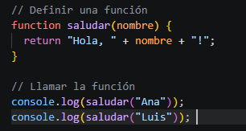

## **¿Qué es una función de flecha?** {#¿qué-es-una-función-de-flecha?}

Las funciones de flecha (arrow functions) son una sintaxis alternativa y más compacta para escribir funciones, introducida en ES6 (2015). Usan el símbolo \=\> (que se lee "flecha" o "arrow"). 

Son equivalentes en muchos casos a las funciones tradicionales, pero con menos código y algunas diferencias de comportamiento importantes.

## **3.1 Evolución de la sintaxis** {#3.1-evolución-de-la-sintaxis}

Veamos cómo la misma función se puede escribir de diferentes maneras, cada vez más corta.

*

## **3.2 Sintaxis** {#3.2-sintaxis}

### **Sin parámetros — los paréntesis son obligatorios**

*

### **Con un solo parámetro — los paréntesis son opcionales**

*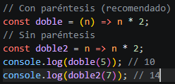

### **Con múltiples parámetros — los paréntesis son obligatorios**

*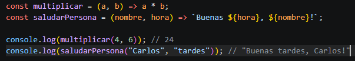

### **Con cuerpo de múltiples líneas — necesitas { } y return**

*

## **3.3 Uso con métodos de arrays** {#3.3-uso-con-métodos-de-arrays}

Las funciones flecha funcionan muy bien, especialmente cuando se usan como callbacks en métodos de array.

*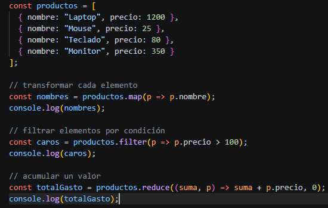

## **3.4 this en funciones flecha — diferencia clave** {#3.4-this-en-funciones-flecha-—-diferencia-clave}

La diferencia más importante entre funciones tradicionales y funciones flecha es el comportamiento de this.  
Las funciones tradicionales tienen su propio this que depende de cómo son llamadas. Las funciones flecha no tienen su propio this, sino que heredan el this del contexto donde fueron creadas.

*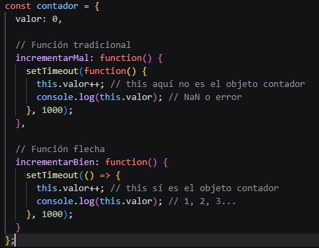

## **3.5 Cuándo SÍ y cuándo NO usar funciones flecha** {#3.5-cuándo-sí-y-cuándo-no-usar-funciones-flecha}

Úsalas para Callbacks en métodos de array (map, filter, reduce, etc.), funciones simples de una línea, cuando necesitas heredar el this del contexto externo y en event listeners dentro de clases. y NO las uses para métodos de un objeto que usen this, constructores con new, funciones que necesiten el objeto arguments o funciones generadoras (function\*).

# **4\. ¿QUÉ ES LA DESESTRUCTURACIÓN DE VARIABLES?** {#4.-¿qué-es-la-desestructuración-de-variables?}

## **¿Qué es?** {#¿qué-es?}

La desestructuración es una sintaxis de ES6 que permite extraer valores de arrays u objetos y asignarlos a variables individuales de forma elegante y concisa, todo en una sola línea.  
Antes de la desestructuración, extraer múltiples valores de un objeto era tedioso.

*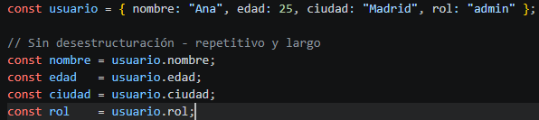

*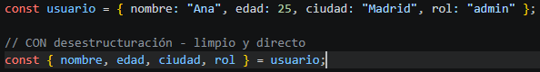

## **4.1 Desestructuración de Objetos** {#4.1-desestructuración-de-objetos}

### **Sintaxis básica**

*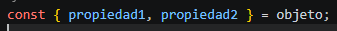

Las variables deben tener el mismo nombre que las propiedades del objeto.

### **Ejemplo**

*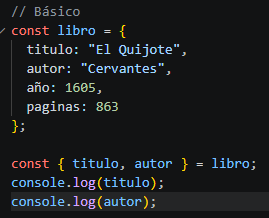

## **4.2 Desestructuración de Arrays** {#4.2-desestructuración-de-arrays}

Con arrays, la extracción es por posición, no por nombre.

### **Sintaxis básica**

*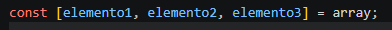

### **Ejemplos**

*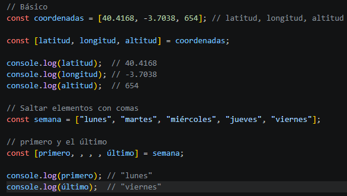

## **4.3 Desestructuración en parámetros de funciones** {#4.3-desestructuración-en-parámetros-de-funciones}

Uno de los usos más comunes es desestructurar directamente en los parámetros de una función. Esto mejora mucho la legibilidad.

*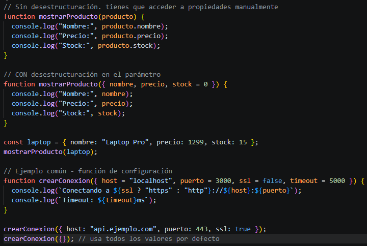

## **4.4 Desestructuración en bucles for...of** {#4.4-desestructuración-en-bucles-for...of}

*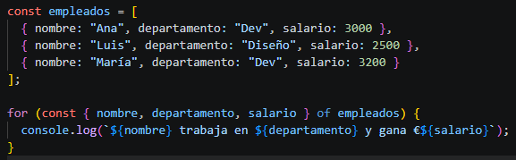

# **5\. ¿QUÉ HACE EL OPERADOR DE EXTENSIÓN (SPREAD & REST)?** {#5.-¿qué-hace-el-operador-de-extensión-(spread-&-rest)?}

## **¿Qué es?** {#¿qué-es?-1}

El operador ... (tres puntos) tiene dos usos relacionados pero opuestos dependiendo del contexto.

* **Spread (extensión):** expande un array u objeto, desparramando sus elementos en otro lugar.  
* **Rest (resto):** agrupa múltiples elementos en un array u objeto.

Mismo símbolo, dos comportamientos distintos según dónde se use.

## **5.1 Spread en Arrays** {#5.1-spread-en-arrays}

### **Expandir elementos de un array**

*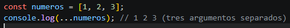

### **Combinar arrays**

*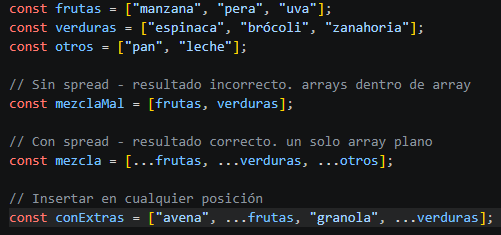

### **Copiar arrays (copia superficial)**

*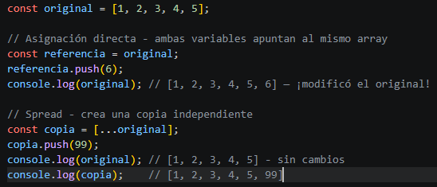

### **Pasar array como argumentos a una función**

*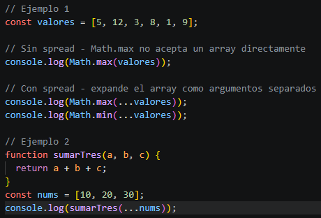

### **Convertir string en array de caracteres**

*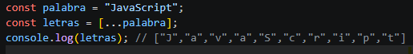

## **5.2 Spread en Objetos** {#5.2-spread-en-objetos}

### **Copiar objetos**

*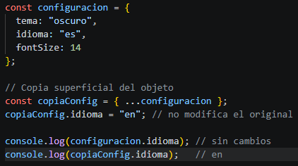

### **Combinar objetos**

*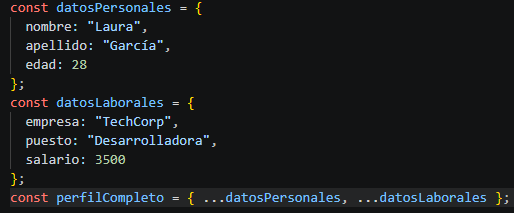

### **Actualizar propiedades de un objeto**

*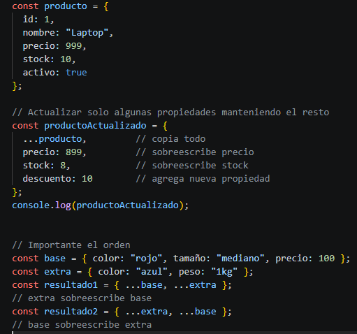

## **5.3 Rest Operator — agrupar elementos** {#5.3-rest-operator-—-agrupar-elementos}

El operador ... en posición de parámetros o al final de una desestructuración actúa como "rest": recoge todos los elementos sobrantes en un array.

### **Rest en parámetros de funciones**

*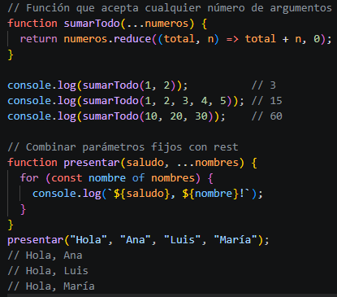

### **Rest en desestructuración de arrays**

*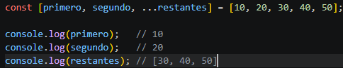

### **Rest en desestructuración de objetos**

*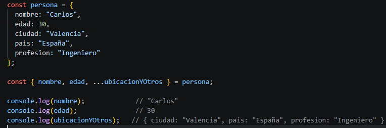

## **5.4 Resumen: Spread vs Rest** {#5.4-resumen:-spread-vs-rest}

|  | Spread (...) | Rest (...) |
| :---- | :---- | :---- |
| ¿Dónde aparece? | Al usar el valor (llamada, asignación) | Al definir (parámetros, desestructuración) |
| ¿Qué hace? | Expande / desparrama | Agrupa / recoge |
| Ejemplo | Math.max(...arr) | function f(...args) |
| Resultado | Múltiples valores separados | Un único array |

# **6\. ¿QUÉ ES LA PROGRAMACIÓN ORIENTADA A OBJETOS (POO)?** {#6.-¿qué-es-la-programación-orientada-a-objetos-(poo)?}

## **¿Qué es la POO?** {#¿qué-es-la-poo?}

La POO (Programación Orientada a Objetos) es un paradigma de programación que organiza el código en torno a objetos, que representan entidades del mundo real. Cada objeto combina atributos (datos, como nombre o edad) y métodos (acciones, como saludar o calcular algo). En lugar de centrarse solo en instrucciones paso a paso, la POO se enfoca en cómo interactúan estos objetos entre sí, lo que hace el código más intuitivo y cercano a la realidad.

Se basa en cuatro principios clave, el encapsulamiento, herencia, polimorfismo y abstracción. Gracias a esto, la POO facilita la organización, reutilización y mantenimiento del código, siendo fundamental en el desarrollo de aplicaciones modernas.

## **6.1 Los cuatro pilares de la POO** {#6.1-los-cuatro-pilares-de-la-poo}

### **1\. Encapsulamiento**

Agrupa datos y métodos relacionados en un objeto, ocultando los detalles internos. Solo expones lo necesario.

### **2\. Herencia**

Una clase puede heredar propiedades y métodos de otra, evitando duplicar código.

### **3\. Polimorfismo**

Objetos de distintas clases pueden responder al mismo método de formas diferentes.

### **4\. Abstracción**

Simplifica la complejidad mostrando solo lo esencial y ocultando los detalles.

## **6.2 Clases y Objetos en JavaScript** {#6.2-clases-y-objetos-en-javascript}

### **¿Qué es una clase?**

Una clase es un molde o plantilla que define la estructura y comportamiento de los objetos que se crearán a partir de ella. Puedes crear muchos objetos distintos a partir del mismo molde.

*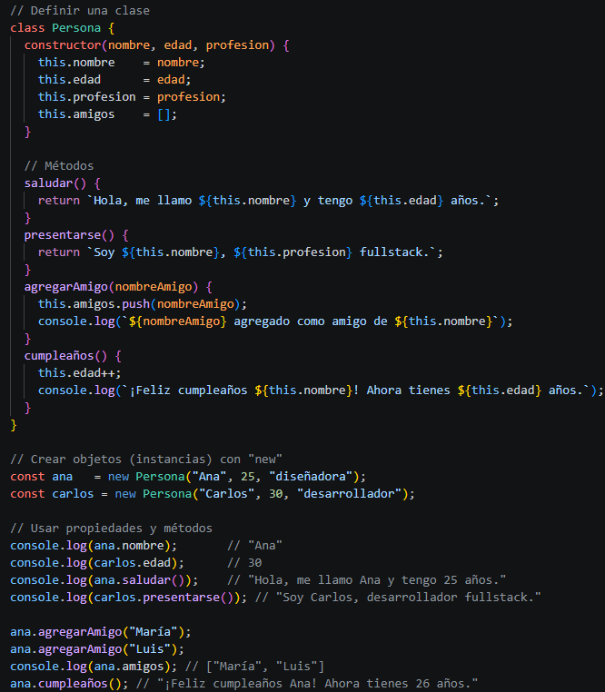

## **6.3 Herencia con extends y super** {#6.3-herencia-con-extends-y-super}

La herencia permite crear clases más específicas basadas en clases más generales.

*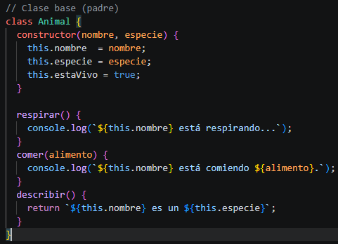

*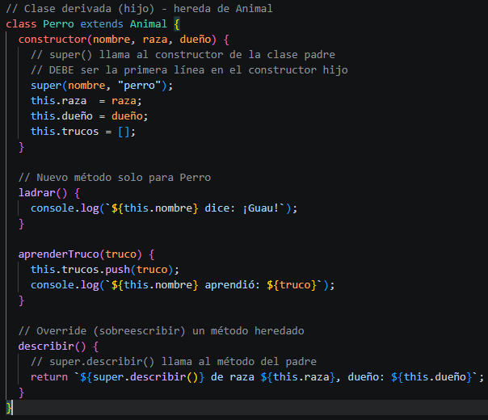
*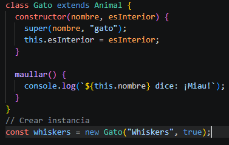

## **6.4 Getters y Setters** {#6.4-getters-y-setters}

Los getters y setters permiten controlar el acceso a las propiedades.

*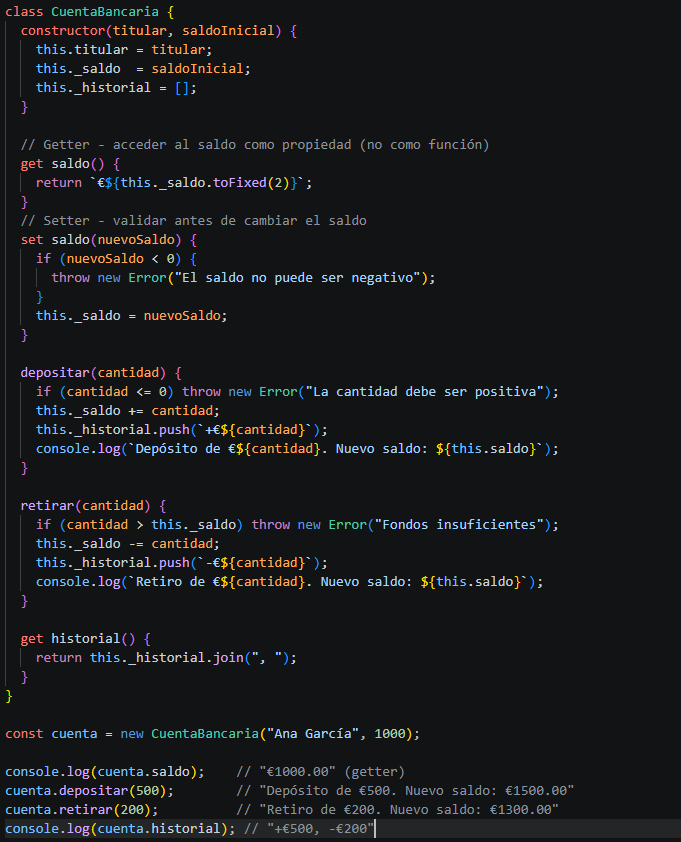

## **6.5 Métodos y propiedades estáticas** {#6.5-métodos-y-propiedades-estáticas}

Los métodos static pertenecen a la clase, no a los objetos individuales.

*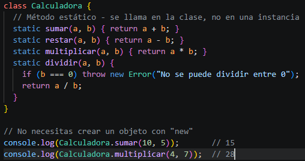

# **7\. ¿QUÉ ES UNA PROMESA EN JS?** {#7.-¿qué-es-una-promesa-en-js?}

## **El problema del código asíncrono** {#el-problema-del-código-asíncrono}

JavaScript es single-threaded. Ejecuta una sola instrucción a la vez. Sin embargo, muchas operaciones tardan tiempo, llamadas a APIs, lectura de archivos, temporizadores. Si el código esperará a que terminaran, la interfaz se congelaría.  
JavaScript resuelve esto con código asíncrono, inicia la operación, continúa ejecutando otras cosas, y cuando la operación termina, ejecuta una función de respuesta.

### **El problema con callbacks (la forma antigua)**

Antes de las promesas, se usaban callbacks, que son funciones que se ejecutan cuando algo termina. El problema es que anidándolos se vuelven ilegibles.

*

## **7.1 ¿Qué es una promesa?** {#7.1-¿qué-es-una-promesa?}

Una Promesa (Promise) es un objeto que representa el resultado eventual (éxito o fracaso) de una operación asíncrona. Es como un "vale" o "recibo", te promete que cuando la operación termine, tendrás el resultado (o sabrás que falló).

## **7.2 Crear una promesa** {#7.2-crear-una-promesa}

*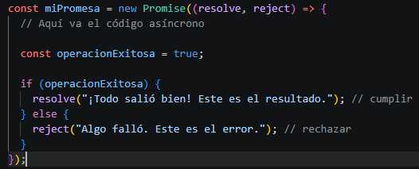

El constructor de Promise recibe una función con dos parámetros:

* **resolve:** función que se llama cuando todo salió bien, con el resultado  
* **reject:** función que se llama cuando algo falló, con el error

## **7.3 Consumir una promesa con .then(), .catch(), .finally()** {#7.3-consumir-una-promesa-con-.then(),-.catch(),-.finally()}

*

## **7.4 Métodos estáticos de Promise** {#7.4-métodos-estáticos-de-promise}

### **Promise.all() — esperar que TODAS terminen**

*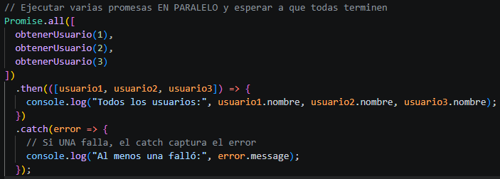

### **Promise.allSettled() — esperar todas aunque fallen**

*

### **Promise.race() — la primera que termine gana**

*

# **8\. ¿QUÉ HACEN ASYNC Y AWAIT?** {#8.-¿qué-hacen-async-y-await?}

## **El problema con las cadenas de .then()** {#el-problema-con-las-cadenas-de-.then()}

Las promesas con .then() ya son mucho mejor que los callbacks, pero para operaciones complejas el código se puede volver difícil de leer. async/await resuelve esto.

## **8.1 ¿Qué es async/await?** {#8.1-¿qué-es-async/await?}

async y await son palabras clave introducidas en ES2017 (ES8) que permiten trabajar con promesas de forma mucho más legible y natural, como si el código asíncrono fuera síncrono.  
Internamente siguen siendo promesas. No añaden nueva funcionalidad, solo hacen el código más fácil de leer y escribir.

### **async**

Poner async antes de una función hace dos cosas:

1. Permite usar await dentro de ella  
2. Hace que la función siempre devuelva una promesa automáticamente

*

### **await**

Solo se puede usar dentro de funciones async. Pausa la ejecución de la función hasta que la promesa se resuelva, y devuelve el valor resultante (no la promesa).

*

## **8.2 Comparación directa: Promesas vs async/await** {#8.2-comparación-directa:-promesas-vs-async/await}

*

| 💡 RECOMENDACIÓN: Usa siempre async/await en código nuevo. Usa Promise.all cuando necesites ejecutar operaciones independientes en paralelo. |
| :---- |